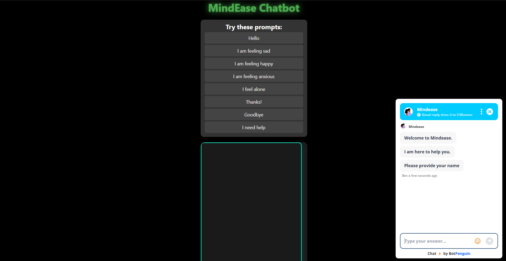

# MindEase – Mental Health Chatbot

MindEase is a simple, browser-based mental health chatbot built using HTML, CSS, and JavaScript. Designed with a clean and calming UI, MindEase encourages users to share their feelings and provides gentle, empathetic responses to help guide them toward mental wellness.

---

## 🌟 Features

* Friendly and empathetic bot responses
* Predefined prompts for easy interaction
* Smooth typing animation to mimic real conversations
* Responsive and scrollable chat interface
* Modern UI with dark theme and animations

---

## 💻 Live Preview

A basic example setup (save this as `index.html`):

```html
<!DOCTYPE html>
<html lang="en">
<head>
  <meta charset="UTF-8" />
  <meta name="viewport" content="width=device-width, initial-scale=1.0" />
  <title>MindEase Chatbot</title>
  <link rel="stylesheet" href="style.css" />
</head>
<body>
  <div class="container">
    <h1 class="heading">MindEase</h1>
    <p class="description">Your friendly mental health companion 💬</p>
    <div class="chat-box" id="chat-box"></div>
    <input type="text" id="user-input" placeholder="Type your message..." />
    <button onclick="sendMessage()">Send</button>
  </div>
  <script src="script.js"></script>
</body>
</html>
```

---

## 🛠 Technologies Used

* HTML5
* CSS3
* JavaScript (Vanilla)

---

## 🚀 Getting Started

1. Clone this repository
2. Open `index.html` in your browser
3. Start chatting with MindEase!

---
## Screenshots

### Desktop View


## 🤝 Contributing

Feel free to fork this project and improve the responses, UI, or add new features. Pull requests are welcome!
---
## 💬 Example Interaction

```
You: I'm feeling anxious.
MindEase: It's okay to feel anxious sometimes. Want to talk more about what's making you feel that way?
```


